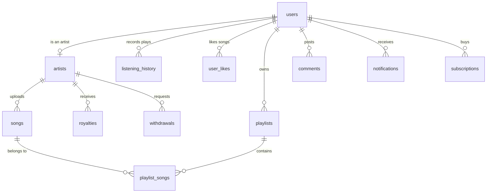

# Legacy CamSound Project Specification & Migration Reference

This document serves as the absolute source of truth for the legacy PHP/MySQL codebase layout, user interfaces, database structures, and business logic. It provides all context needed to build, debug, or expand the MERN stack migration without needing to reference the legacy PHP codebase again.

---

## 1. Project Overview & Theme System

The legacy project was a localized Cameroonian music platform named **CamSound** (also referenced as *AfroRhythm* in style sheets). 

### Visual Theme System
- **Color Scheme:** Dark emerald forest green combined with deep charcoal colors and golden yellow highlights.
  - Deep Dark Background: `#0B0F0C` (with custom background radial gradients creating subtle lighting effects)
  - Card & Component Backgrounds: `#111827` (Charcoal) or `#1E1E1E` (Dark Grey) with `rgba(17, 24, 39, 0.5)` glassmorphic blur layers.
  - Dark Green Sectioning: `#0C2B18`
  - Emerald Green brand colors: `#0F3D2E` / `#14532D`
  - Accent/Highlight Gold color: `#FACC15` (Hover: `#D4A212`)
- **Typography:** Custom fonts using 'Poppins' and 'Inter' styled via Google Fonts.
- **Scrollbar:** Rounded thumb in emerald green (`#0F3D2E`) on top of a dark track (`#0B0F0C`).

---

## 2. Legacy Database Schema (MariaDB/MySQL)

The original database consists of 16 relational tables mapping music files, users, subscriptions, activities, and metadata.

### Table Definitions

1. **`users`**
   - Holds core account information for all roles.
   - *Columns:* `id` (INT PK AI), `name` (VARCHAR), `email` (VARCHAR UNIQUE), `phone` (VARCHAR), `password` (VARCHAR), `type` (ENUM: `'admin'`, `'artist'`, `'fan'`), `status` (ENUM: `'active'`, `'pending'`, `'blocked'`), `account_notes` (TEXT), `joined` (DATE), `avatar` (VARCHAR), `created_at` (TIMESTAMP), `last_login` (TIMESTAMP).

2. **`artists`**
   - Maps specific users as artists and stores metadata.
   - *Columns:* `id` (INT PK AI), `user_id` (INT FK -> `users.id`), `name` (VARCHAR), `real_name` (VARCHAR), `genre` (VARCHAR), `followers` (INT), `songs_count` (INT), `status` / `verification` (ENUM: `'verified'`, `'pending'`, `'rejected'`), `bio` (TEXT), `image` (VARCHAR), `instagram_url`, `twitter_url`, `facebook_url`, `youtube_url`, `website`, `location` (VARCHAR), `created_at` (TIMESTAMP).

3. **`songs`**
   - Metadata for uploaded tracks.
   - *Columns:* `id` (INT PK AI), `title` (VARCHAR), `artist_id` (INT FK -> `artists.id`), `genre` (VARCHAR), `duration` (VARCHAR), `plays` (INT), `likes` (INT), `downloads` (INT), `file_path` (VARCHAR), `cover_art` (VARCHAR), `status` (ENUM: `'active'`, `'pending'`, `'blocked'`), `moderation_status` (ENUM: `'pending'`, `'approved'`, `'rejected'`), `moderation_notes` (TEXT), `moderated_by` (INT FK -> `users.id`), `moderated_at` (TIMESTAMP), `uploaded_at` (TIMESTAMP).

4. **`playlists`**
   - *Columns:* `id` (INT PK AI), `user_id` (INT FK -> `users.id`), `name` (VARCHAR), `description` (TEXT), `is_public` (TINYINT), `created_at` (TIMESTAMP).

5. **`playlist_songs`**
   - Join table representing a many-to-many relationship between playlists and songs.
   - *Columns:* `id` (INT PK AI), `playlist_id` (INT FK -> `playlists.id`), `song_id` (INT FK -> `songs.id`), `added_at` (TIMESTAMP).

6. **`listening_history`**
   - Tracks every streaming play transaction.
   - *Columns:* `id` (INT PK AI), `user_id` (INT FK -> `users.id`), `song_id` (INT FK -> `songs.id`), `played_at` (TIMESTAMP).

7. **`user_likes`**
   - Many-to-many lookup for liked songs.
   - *Columns:* `id` (INT PK AI), `user_id` (INT FK -> `users.id`), `song_id` (INT FK -> `songs.id` UNIQUE together), `created_at` (TIMESTAMP).

8. **`follows`**
   - Maps fans following artists.
   - *Columns:* `id` (INT PK AI), `user_id` (INT FK -> `users.id`), `artist_id` (INT FK -> `artists.id` UNIQUE together), `created_at` (TIMESTAMP).

9. **`comments`**
   - Hierarchical comment list linked directly to songs.
   - *Columns:* `id` (INT PK AI), `user_id` (INT FK -> `users.id`), `song_id` (INT FK -> `songs.id`), `content` (TEXT), `parent_id` (INT FK -> `comments.id`), `is_pinned` (TINYINT), `created_at` (TIMESTAMP).

10. **`notifications`**
    - Stores platform alerts.
    - *Columns:* `id` (INT PK AI), `user_id` (INT FK -> `users.id`), `message` (TEXT), `type` (VARCHAR), `target_id` (INT), `is_read` (TINYINT), `created_at` (TIMESTAMP).

11. **`plans`**
    - Subscription choices shown on the pricing grid.
    - *Columns:* `id` (INT PK AI), `name` (VARCHAR), `price` (DECIMAL), `currency` (VARCHAR), `period` (VARCHAR), `description` (TEXT), `features` (JSON), `is_popular` (TINYINT), `button_text` (VARCHAR), `button_style` (VARCHAR), `created_at` (TIMESTAMP).

12. **`subscriptions`**
    - Links users to activated plans.
    - *Columns:* `id` (INT PK AI), `user_id` (INT FK -> `users.id`), `plan_name` (VARCHAR), `amount` (DECIMAL), `status` (ENUM: `'active'`, `'expired'`, `'cancelled'`), `start_date` (DATE), `end_date` (DATE), `created_at` (TIMESTAMP).

13. **`payments`**
    - Cash flows for subscription transactions.
    - *Columns:* `id` (INT PK AI), `user_id` (INT FK -> `users.id`), `subscription_id` (INT FK -> `subscriptions.id`), `amount` (DECIMAL), `currency` (VARCHAR), `payment_method` (VARCHAR), `transaction_id` (VARCHAR), `status` (ENUM: `'pending'`, `'completed'`, `'failed'`, `'refunded'`), `created_at` (TIMESTAMP).

14. **`withdrawals`**
    - Records artist requests to cash out royalties.
    - *Columns:* `id` (INT PK AI), `artist_id` (INT FK -> `artists.id`), `amount` (DECIMAL), `momo_number` (VARCHAR), `status` (ENUM: `'pending'`, `'completed'`, `'failed'`), `transaction_id` (VARCHAR), `created_at` (TIMESTAMP), `processed_at` (TIMESTAMP).

15. **`royalties`**
    - Accumulated earnings calculated periodically.
    - *Columns:* `id` (INT PK AI), `artist_id` (INT FK), `song_id` (INT FK), `amount` (DECIMAL), `period_start` (DATE), `period_end` (DATE), `plays_count` (INT), `calculated_at` (TIMESTAMP), `paid_at` (TIMESTAMP), `status` (ENUM: `'pending'`, `'paid'`).

16. **`settings`**
    - Arbitrary global key-value configuration values.
    - *Columns:* `setting_key` (VARCHAR PK), `setting_value` (TEXT), `updated_at` (TIMESTAMP).

---

## 3. Page-by-Page Structure and UX Flows

### 3.1. Landing Page (`index.html`)
The entry point of the app has a standard structure designed to entice listeners and artists:
1. **Sticky Top Navigation Bar:** Toggles background opacity on scroll. Links to Home, Discover, Artists, and Pricing, with Login and Sign Up actions.
2. **Hero Block:** Left column features bold typography (*"Discover, Stream & Promote Cameroonian Music."*) and call-to-actions. Right column renders three stacked overlapping cards with a spinning golden vinyl record overlay.
3. **How CamSound Works Section:** Explains the flow (*Artists Upload* -> *Fans Discover* -> *Grow Together*) using centered layout grids separated by chevron indicator lines.
4. **Why Choose Us Section:** Placed in a dark forest green background wrapper displaying 4 feature modules (Local Focus, Fair Visibility, Artist Subscriptions, Easy Discovery).
5. **Featured Artists Section:** Grid displaying 6 trending Cameroonian talents. Cards show an artist avatar, name, music genre tag, and a hoverable floating play button overlay.
6. **Trending Genres Section:** 4 columns representing Makossa, Afrobeat, Bikutsi, and Assiko. Includes custom icons inside yellow gold panels.
7. **Platform Statistics Bar:** Centered highlights showing monthly streams count (1M+), active artist size (500+), and overall database song counts (10K+).
8. **Testimonials Grid:** Displays 3 cards showcasing quotes from artists, fans, and producers next to 5 star rating indicators.
9. **CTA Block:** A simple banner triggering signup.
10. **Footer:** Quick links, legal policies, social icon circles, and a small admin portal doorway.

---

### 3.2. Authentication Pages (`auth/`)

#### Login Form (`login.html` & `auth-logic.js`)
- Renders inside a wave-decorated background.
- Holds form inputs for Email Address and Password with absolute layout icon tags inside inputs.
- Integrates a password visibility show/hide toggle.
- Automatically handles success notifications, redirects, and error handling timeouts.
- **Redirection Logic:** Reads user type on successful login and routes relative to parent root:
  - If `user.type === 'artist'` -> redirect to `../artist.html`
  - If `user.type === 'admin'` -> redirect to `../admin.html`
  - Otherwise -> redirect to `../fan.html`

#### Signup Form (`signup.html` & `signup-logic.js`)
- Handles role selection before user creation.
- **URL Param Pre-Selection:** Automatically reads url params like `?role=artist` to highlight role options right away.
- **Step 1 (Role Pick):** Listener vs Artist selection layout panels.
- **Step 2 (Account Details):** Input grids containing Name, Email Address, Password, and a Terms Agreement check.
- **Password Strength Checker:** Measures the strength of the password based on four conditions:
  - Length >= 8 chars (+1 score)
  - Mixed casing (a-z and A-Z) (+1 score)
  - Contains numbers (+1 score)
  - Contains special symbols (+1 score)
  - *Feedback:* Dynamically fills a color bar based on score (1: Red/Weak, 2: Orange/Fair, 3: Light Green/Good, 4: Forest Green/Strong).

---

### 3.3. Dashboards (`fan.html`, `artist.html`, `admin.html`)

All dashboards share a standardized layout (`dashboard-layout.css`) consisting of:
*   `#sidebar-wrapper` (width 280px, sticky, collapsible on mobile).
*   `.top-bar` (height 70px, displays search bar, notification tray, and user dropdown).
*   `#persistentPlayer` / `.music-player-bar` (bottom bar offset height 80-90px).

#### 3.3.1. Fan / Listener Dashboard (`fan.html` & `fan.js`)
- **Grouped Sidebar Nav:** 
  - `DISCOVER`: Home, Browse, Genres, Community.
  - `MY MUSIC`: My Music (Favorites count), Playlists, History.
  - `FOLLOWING`: Following, Notifications.
  - `ACCOUNT`: Profile, Settings, Logout.
- **Sidebar Quick Stats:** An accordion drawer showing Total Plays, Songs Liked, and Hours Listened.
- **Home View (Discover):**
  - Displays a customized welcome banner (*"Welcome back, [Name]!"*).
  - Side-by-side grids rendering **New Releases** and **Trending Songs**.
  - **Browse by Genre** horizontal tag list.
  - Recommended playlists and trending artists array.
- **Browse View:** Filterable song grid searchable in real-time.
- **Genres View:** Grid showing cards for classic genres with representative icons.
- **Community View:** Connects members. Includes a composer with a dropdown to select a song to discuss, a text entry post form, activity tabs (All, Discussions, Spotlight), and side columns showing trending discussion topics.

#### 3.3.2. Artist Dashboard (`artist.html` & `artist.js`)
- **Sidebar Nav:** Dashboard Overview, Profile Management, Music Uploads, Performance & Analytics, Social Interaction, Revenue & Royalties, Subscription Plan, Notifications, Logout.
- **Overview Area:**
  - Header profile panel showing name, avatar image, verified tick status, and biography details.
  - 4-column metric board: Total Plays, Total Tracks, Followers, and Pending Revenue.
  - List of the artist's top-performing songs.
- **Upload Form (`Music Uploads`):**
  - Input fields for Title, Genre (Select), Audio File, and Cover Art.
  - Posts file streams to the backend to populate the artist's library.
  - Displays moderation queues where pending uploads reside until approved by an admin.

#### 3.3.3. Admin Dashboard (`admin.html` & `admin.js`)
- **Sidebar Nav:** Overview, Users, Songs, Artists, Moderation Queue, Payments, Withdrawals, Reports, Settings.
- **Overview Area:**
  - Standard metric board: Total registered users, active artists count, global streams, and total payments revenue.
  - **User Growth Bar Chart:** A vertical CSS column chart visualizing monthly growth dynamics.
  - **Moderation Queue Module:** Allows admins to review pending artist uploads and either approve them (making them active and visible) or reject/block them.
  - **Genre Distribution Tag Grids:** Lists music tags alongside count indicators.

---

## 4. Audio Player Bar System (`modal-player.js` / `player.js`)

All music play interaction delegates to the unified persistent music bar at the bottom:
- **Left Panel:** Displays active track artwork cover thumbnail, song title, and artist name.
- **Center Controls:**
  - Backward/Forward buttons.
  - Circular Play/Pause button.
  - Timeline progress bar showing elapsed duration vs total track duration.
  - Seek interface (clicking on the timeline calculates click percentage and updates track playback position).
- **Right Panel:** Mute toggle icon and linear volume slider.

---

## 5. MERN Stack Integration Strategy

This section lists the legacy PHP backend endpoints and maps them to the new Express Node.js controllers.

| Legacy PHP File | MERN Express Endpoint | Controller File | Functionality |
| :--- | :--- | :--- | :--- |
| `backend/api/login.php` | `POST /api/auth/login` | `authController.ts` | Authenticates users, signs JWT, sets session |
| `backend/api/users.php` | `POST /api/auth/signup` | `authController.ts` | Handles account registrations (fan vs artist) |
| `backend/api/logout.php` | `POST /api/auth/logout` | `authController.ts` | Clears tokens/sessions |
| `backend/api/songs.php` | `GET /api/songs` | `songsController.ts` | Retrieves song lists, limits query collections |
| `backend/api/upload.php` | `POST /api/upload/song` | `uploadsController.ts` | Streams audio file/cover art to Cloudinary |
| `backend/api/stats.php` | `GET /api/stats/global` | `statsController.ts` | Computes admin overall counters |
| `backend/api/artist_stats.php` | `GET /api/stats/artist` | `statsController.ts` | Computes artist analytics |
